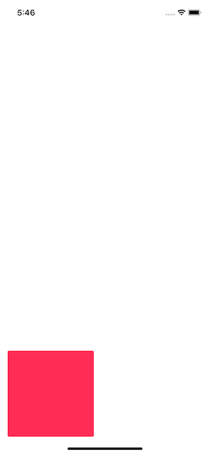

# JSConstraints

[](https://cocoapods.org/pods/JSConstraints)
[](https://cocoapods.org/pods/JSConstraints)
[](https://cocoapods.org/pods/JSConstraints)

> A tiny Swift library written with only one thing in mind: *Blazin Fast Programmatic Constraints-Typing*

**JSConstraints** is a really small library extending `UIView` and `UIStackView` functionalities
- - - -
<br>

## What’s JSConstraints?
- - - -
<br>

## Installation
JSConstraints is available through [CocoaPods](https://cocoapods.org). To install
it, simply add the following line to your Podfile:

```ruby
pod 'JSConstraints'
```
- - - -
<br>

## How It Works?

### ADDING CONSTRAINTS
```swift
// First, add pink square to its superview
view.addSubview(pinkSquare)

// Then, set constraints
pinkSquare.setConstraints([
.bottom(view.safeAreaLayoutGuide.bottomAnchor) + .constant(18),
.leading(view.leadingAnchor) + .constant(35)
])
```

<br>

#### What Just Happened?
1. We constrained `pinkSquare` 18 point from our view’s **Safe Area Layout Guide’s bottom**
```swift
let bottomConstraint = .bottom(view.safeAreaLayoutGuide.bottomAnchor) + .constant(18)
```
<br>

2. We also constrained `pinkSquare` **15 points from view’s leading anchor**
```swift
let leadingConstraint = .leading(view.leadingAnchor) + .constant(15)
```
<br>

#### Refactored Form
Let’s put it all back together, and we get:
```swift
// Add pink square to superview
view.addSubview(pinkSquare)

// Set constraints
pinkSquare.setConstraints([ bottomConstraint, leadingConstraint ])

/*
You can also write with JSConstraint enums directly with '.anchor() + .constant()' format
*/
```
- - - -
<br>

### CENTERING A VIEW
```swift
yellowCircle.centerIn(superview: self.view)
```

<br>

#### What Just Happened?
We constrained `yellowCircle` in the **center** of the main view
- - - -
<br>


### PIN TO SUPERVIEW
```swift
let padding: CGFloat = 18
indigoView.pinTo(superview: self.view, adding: padding)
```  

<br>

#### Note
```swift
/*
If you pass an instance of `UILayoutGuide`, Our `indigoView` will also be inserted automatically to `superview`
*/

otherView(layoutGuide: view.safeAreaLayoutGuide)
```
- - - -
<br>


## How About Dynamic Constraints?
**JSConstraints** methods always return the collection of successfully activated constraints. We can it to toggle constraints between `active` and `inactive` state as follows.

### 1. GET CONSTRAINTS REFERENCES
```swift
// Get constraints refs returned
var dynamicConstraints: [NSLayoutConstraint] = yellowCircle.setConstraints([ .bottom(blueRectangle.topAnchor) ])
```
Here, list of activated constraints of type `[NSLayoutConstraint]` is return to us. We can save the result in variable `dynamicConstraints`.
<br>
<br>

### 2. UPDATE CONSTRAINTS
```swift
// Deactivate dynamic constraints
dynamicConstraints.forEach { $0.isActive = false }

// Set new constraints
yellowCircle.centerIn(superview: self.view)
```
Here’s we’re setting up `isActive` property of active constraints to `false`. Then, we add new constraints
- - - -
<br>

### Result

<br>

## Author
Jonathan Sack
📨  jonathan.sack91@gmail.com
<br>

## License
JSConstraints is available under the MIT license. See the LICENSE file for more info.
